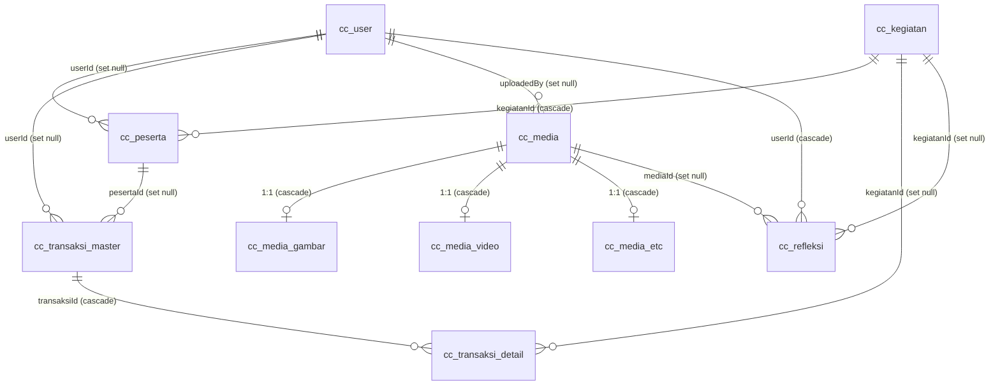

# Design — Compassionate Companion Website

Dokumen struktur & gaya untuk project di `C:\sam\COSMOS\ccwebsite`.
Isinya **deskriptif**: apa yang benar-benar ada di kode per 11 Agustus 2026, bukan
rencana atau cita-cita. Pasangan dokumen ini adalah [`journal.md`](journal.md)
(catatan per sesi kerja).

> **Catatan sinkronisasi.** Badan dokumen ini mencerminkan keadaan setelah Sesi 3
> (11 Agu 2026), dengan tambalan Sesi 9 di [§12](#12-perubahan-sesi-9-12-agu-2026).
> Isi `journal.md` Sesi 1 sudah banyak yang tidak berlaku — pernyataan "tidak ada
> ORM", "Tailwind praktis mati", dan "tidak ada backend" semuanya sudah usang.
> Selisihnya dirangkum di [§10](#10-selisih-terhadap-journalmd-sesi-1); entri Sesi 2
> dan seterusnya di `journal.md` mencatat apa yang berubah dan mengapa.

---

## 1. Ringkasan arsitektur

Situs bilingual (ID/EN) untuk komunitas pendampingan berbasis Spiritualitas Ignasian,
dengan area admin terpisah. Aplikasi **satu proses**: Nuxt 4 menangani frontend
sekaligus backend (Nitro), database SQLite lokal berbasis file.

| Lapisan | Teknologi | Status |
|---|---|---|
| Framework | Nuxt **4.4.5** (Vue 3.5, Nitro 2.13, Vite 7) | aktif |
| Routing publik | file-based + `@nuxtjs/i18n` strategy `prefix` | aktif |
| UI kit | `@nuxt/ui` 4 + Tailwind v4 | seluruh kontrol antarmuka |
| Styling nyata | CSS tulis tangan (identitas visual) + Nuxt UI (kontrol) | aktif |
| Gambar | `@nuxt/image` 2.0.0 | terpasang, dipakai 1× |
| Ikon | `@iconify-json/lucide` via Nuxt UI | dipakai luas |
| Database | SQLite (`better-sqlite3`) + Drizzle ORM | 12 tabel, 3 migrasi, terisi |
| Autentikasi | sesi cookie terenkripsi (`useSession` h3) | aktif, 4 role |
| API | Nitro `server/api/` | 27 endpoint |

Karakter project saat ini: **tiga alur utama sudah tersambung penuh ke database**
(event + pendaftaran, autentikasi + profil, refleksi), sementara sebagian area admin
(jurnal, contributors, detail event) masih menampilkan array literal di dalam `.vue`.

---

## 2. Peta folder

Struktur memakai konvensi **Nuxt 3** (srcDir = root), bukan layout default Nuxt 4
yang menaruh sumber di `app/`. Nuxt 4 masih mendukungnya lewat backward-compat.

```
ccwebsite/
├── app.vue                     shell + fondasi <head>: lang, title, OG, canonical, hreflang
├── nuxt.config.ts              port 3009, modul, i18n, colorMode terkunci light
├── drizzle.config.ts           dialect sqlite → ./data/cc.db
│
├── assets/css/
│   ├── tailwind.css            ENTRY TUNGGAL — font, tailwind, @nuxt/ui, layer, tema
│   └── main.css                1053 baris CSS tulis tangan (jantung tampilan)
│
├── layouts/
│   ├── default.vue             header sticky + footer publik (56 baris)
│   └── admin.vue               sidebar + main (16 baris, tanpa <script>)
│
├── app.config.ts               pemetaan warna Nuxt UI ke ramp brand (WAJIB di sini)
│
├── components/                 EventResources · EventRegisterModal · RefleksiGrid
├── composables/useAuth.ts      keadaan sesi di sisi klien
│
├── middleware/
│   ├── locale.global.ts        client-side: paksa /id kalau path tanpa prefix
│   └── admin.global.ts         penjaga /admin, berjalan juga saat SSR
│
├── pages/                      23 halaman
│   ├── index.vue  events.vue  jurnal.vue  insights.vue
│   ├── login.vue  profil.vue
│   ├── reflection-journey.vue  sharing-*.vue
│   ├── events/                 3 halaman detail event
│   └── admin/                  11 halaman
│
├── public/
│   ├── favicon.svg             monogram CC (hijau #2B4028 + emas #E1B032)
│   └── images/                 6 PNG (profil, cover event, ikon WA, placeholder)
│
├── server/
│   ├── middleware/locale-redirect.ts    server-side: redirect legacy → /id
│   ├── api/
│   │   ├── auth/               login.post · logout.post · me.get
│   │   ├── events/             index.get · [slug]/register.post
│   │   ├── users/              index.get · me.get · me.patch · [id].get · password.post
│   │   ├── refleksi/           index.post · [id].delete
│   │   ├── admin/stats.get.ts  rekap dashboard
│   │   ├── media/              index.get · upload.post · [id].delete
│   │   └── storage/[...path].get.ts     serve blob dari DB
│   ├── db/
│   │   ├── index.ts            klien better-sqlite3 + drizzle (WAL, FK ON)
│   │   ├── seed.ts             idempoten: 4 akun + 5 kegiatan
│   │   ├── schema/             6 berkas → 10 tabel
│   │   └── migrations/         0000_marvelous_cerebro · 0001_refleksi
│   └── utils/
│       ├── session.ts          sesi cookie + wajibLogin / wajibRole
│       ├── password.ts         hash & verifikasi scrypt
│       ├── kegiatan.ts         faseKegiatan() + pendaftaranTerbuka()
│       ├── profil.ts           penyusun payload profil (dipakai 2 endpoint)
│       ├── riwayat.ts          riwayat keikutsertaan per user
│       ├── media-services.ts   simpanMedia() + mediaService
│       └── randomId.ts         generateCcId / slugify / generateNomorTransaksi
│
├── utils/mediaHelper.ts        helper klien (auto-import Nuxt)
└── data/cc.db                  SQLite + WAL
```

**Yang tidak ada** (dan relevan): `components/`, `composables/`, `tsconfig.json`,
`.gitignore`, folder `i18n/` atau `locales/`, `server/db/seed.ts`, `.env`.

---

## 3. Alur permintaan

```
Browser
  │
  ├─ /            ──► server/middleware/locale-redirect.ts  ──► 302 /id
  ├─ /events      ──► (idem)                                ──► 302 /id/events
  │
  ├─ /id/... ─┐
  ├─ /en/... ─┤
  │           └─► middleware/locale.global.ts (client, no-op untuk path berprefix)
  │                    │
  │                    └─► layouts/default.vue ──► pages/*.vue  (data literal)
  │
  ├─ /admin/...   ──► lolos kedua middleware ──► layouts/admin.vue (definePageMeta)
  │
  └─ /api/...     ──► Nitro ──► drizzle ──► data/cc.db
```

Ada **dua mekanisme locale yang berjalan paralel**:

| | `server/middleware/locale-redirect.ts` | `middleware/locale.global.ts` |
|---|---|---|
| Sisi | server (Nitro), sebelum route match | client (Vue Router) |
| Cakupan | hanya `/`, `/events`, `/events/*` | semua path non-`/admin` tanpa prefix |
| Aksi | `sendRedirect(302)` | `navigateTo()` |

Keduanya sengaja mengecualikan `/admin`, sejalan dengan `i18n.pages.admin*: false`
di `nuxt.config.ts` — area admin memang berada di luar sistem locale.

---

## 4. Routing & i18n

**Strategi: `prefix`.** Tidak ada route publik tanpa locale — `/id/jurnal` dan
`/en/jurnal` keduanya ada, `/jurnal` selalu di-redirect.

Sepuluh route admin didaftarkan satu per satu dengan `false` di `i18n.pages`
supaya tidak ikut diprefiks. Daftar ini **manual dan harus dijaga**: menambah
halaman admin baru tanpa menambahkannya ke `nuxt.config.ts` akan membuat halaman
itu muncul sebagai `/id/admin/...`.

**i18n dipakai untuk routing saja, bukan translasi.** Tidak ada berkas pesan,
tidak ada `useI18n()` atau `$t()` di satu pun berkas. Bilingual dikerjakan dengan
ternary di template:

```vue
const isEn = computed(() => route.path.startsWith('/en'))
{{ isEn ? 'About' : 'Tentang' }}
```

Tiga varian helper path hidup berdampingan, masing-masing ditulis ulang per berkas:

| Berkas | Nama | Bentuk |
|---|---|---|
| `layouts/default.vue` | `localized()` | menangani `'/'` → tanpa trailing slash |
| `pages/index.vue` | `langPath()` | template literal langsung |
| `pages/events.vue` | `base` | computed `'/en'` \| `'/id'` |
| `pages/insights.vue` | `path()` | menerima slug tanpa `/` |

Karena tidak ada `components/` dan tidak ada composable bersama, tiap halaman
mendefinisikan ulang logika yang sama.

**Konsekuensi nyata:** sebagian tautan mem-hardcode `/id`, sehingga versi EN bocor
kembali ke ID — mis. `pages/jurnal.vue:18-23` (`path: '/id/reflection-journey'`),
breadcrumb di `pages/reflection-journey.vue:5` dan
`pages/events/listening-as-leadership.vue:35`.

### 4.1 Metadata & SEO

`app.vue` memegang fondasi `<head>` untuk seluruh situs, dibungkus `computed` supaya
ikut berubah saat navigasi sisi klien:

| Elemen | Perilaku |
|---|---|
| `<html lang>` | `id-ID` / `en-US` mengikuti awalan path |
| `titleTemplate` | `"{judul} · Compassionate Companion"`; tanpa judul halaman → judul situs penuh |
| `description`, OG, Twitter | dwibahasa, mengikuti locale |
| `canonical` | absolut, dari `useRequestURL()` (di dev berarti `localhost:3009`) |
| `hreflang` | `id-ID`, `en-US`, `x-default` → ID, disusun dari path tanpa prefix locale |
| `robots` | `noindex, nofollow` untuk `/admin`, `index, follow` selebihnya |
| `icon` | `/favicon.svg` |

Sepuluh halaman publik menimpa `title` + `description` lewat `useSeoMeta` masing-masing.
Untuk halaman jurnal/refleksi, **judul tidak diterjemahkan** (mengikuti bahasa tulisan
aslinya) sementara deskripsi tetap dwibahasa — sesuai aturan di [§4.2](#42-aturan-dwibahasa).

### 4.2 Aturan dwibahasa

Ketentuan yang berlaku untuk semua pekerjaan berikutnya:

- Setiap teks antarmuka **wajib** punya versi ID dan EN.
- **Pengecualian: isi jurnal.** Artikel jurnal tampil dalam bahasa saat ia diposting;
  yang diterjemahkan hanya kerangkanya (label, navigasi, metadata).

Cakupan saat ini masih jauh dari itu — lihat [§11 butir 9](#11-titik-lemah-struktural).
Yang sudah dwibahasa: navigasi, tombol header, seluruh metadata `<head>`, dan sebagian
tombol CTA. Yang belum: hampir seluruh isi halaman, termasuk badan teks `/en`.

**Pola route bersarang.** `pages/events.vue` dan `pages/admin/jurnal.vue` adalah
halaman induk sekaligus daftar, jadi keduanya memakai penjaga eksplisit:

```vue
<NuxtPage v-if="$route.path !== '/id/events' && $route.path !== '/en/events'" />
<main v-else class="event-page"> ... </main>
```

---

## 4.3 Autentikasi & pengamanan rute

Sesi disimpan sebagai **cookie terenkripsi** (`useSession` bawaan h3) — tidak ada tabel
sesi. Isinya minimal: id, username, nama, role.

`userSaatIni()` **memverifikasi ulang ke database setiap permintaan** alih-alih
memercayai isi cookie. Akibatnya akun yang dinonaktifkan atau rolenya diturunkan
langsung kehilangan akses, tanpa menunggu cookie kedaluwarsa.

Area admin dijaga **dua lapis**, dan keduanya diperlukan:

| Lapis | Berkas | Menahan |
|---|---|---|
| Halaman | `middleware/admin.global.ts` | Ketik URL manual. Middleware rute berjalan saat SSR, jadi tertahan sebelum HTML dikirim |
| API | `wajibRole()` per handler | Panggilan langsung ke `/api/**`, yang tidak tersentuh middleware halaman |

Middleware sengaja **global**, bukan dipasang lewat `definePageMeta` per halaman:
halaman admin baru otomatis ikut terlindungi tanpa bergantung pada ingatan penulisnya.

Prinsip yang dipakai berulang: **menyembunyikan di template bukan pengamanan.**
Rekap role di dashboard, misalnya, disaring di `/api/admin/stats` — kalau hanya `v-if`,
datanya tetap terkirim ke browser admin/editor dan terbaca dari devtools.

## 5. Lapisan data (Drizzle + SQLite)

### 5.1 Klien

`server/db/index.ts` membuat satu koneksi proses-tunggal:

- path: `process.env.DATABASE_URL ?? './data/cc.db'`, folder dibuat otomatis
- `journal_mode = WAL` — baca & tulis paralel, penting karena Nitro melayani request bersamaan
- `foreign_keys = ON` — SQLite mematikannya secara default; tanpa ini `onDelete: cascade` tidak jalan

### 5.2 Skema

**Role & wewenang.** `USER_ROLES` punya empat tingkat, dengan **angka kecil berarti
wewenang besar**: `master` (1), `admin` (2), `editor` (3), `user` (4). Level
diturunkan dari role lewat `ROLE_LEVELS` di `server/db/schema/users.ts`, bukan
disimpan sebagai kolom, supaya tidak ada dua sumber kebenaran. Helper
`hasAtLeast(role, minimal)` membandingkan `level <= n` agar satu pemeriksaan mencakup
"role ini ke atas". Enum drizzle `text({ enum })` hanya menghasilkan union type di TS —
di SQLite kolomnya TEXT polos tanpa CHECK, jadi menambah role **tidak butuh migrasi**.

Password di-hash dengan scrypt (`server/utils/password.ts`), memakai `node:crypto`
agar tidak menambah dependensi native. Format `scrypt$N$r$p$salt$hash` menyimpan
parameternya sendiri sehingga hash lama tetap terverifikasi bila biayanya dinaikkan.
Seeder `server/db/seed.ts` (idempoten, dicocokkan lewat `username`) mengisi empat akun
pengembangan, satu per role.

**Fase kegiatan bukan kolom.** Ini pembedaan yang paling mudah tertukar:

| | disimpan? | nilai | ditentukan oleh |
|---|---|---|---|
| `status` | ya, kolom `cc_kegiatan.status` | draft, terbit, selesai, batal | admin |
| **fase** | **tidak** — diturunkan saat dibaca | mendatang, berlangsung, selesai, batal | tanggal vs waktu sekarang |

Fase dihitung `server/utils/kegiatan.ts`. Kalau ia disimpan sebagai kolom, nilainya
basi begitu tanggalnya terlewat dan butuh cron untuk memutakhirkan; menurunkannya saat
dibaca membuatnya selalu benar tanpa pekerjaan latar belakang. `status` bernilai
`batal`/`selesai` tetap menang atas perhitungan tanggal, supaya admin bisa menutup
kegiatan lebih awal.

Sepuluh tabel, semua berprefiks `cc_`. Kolom & enum berbahasa Indonesia
(`kegiatan`, `peserta`, `transaksi`, `harga`, `lunas`), sementara kolom teknis
berbahasa Inggris (`createdAt`, `storageKey`, `mimeType`).



`cc_refleksi` (migrasi `0001`) menampung catatan yang **ditulis peserta sendiri** —
dibedakan dari jurnal yang ditulis dan dikurasi editor. Visibilitasnya bertingkat:
`publik`, `peserta`, `pribadi`; yang `pribadi` hanya terlihat oleh penulisnya dan
pengelola level ≤ 2.

Tiga keputusan desain yang menonjol:

**a. Supertype/subtype untuk media.** `cc_media` memegang blob + `storageKey` +
`publicUrl`; tabel `cc_media_gambar` / `_video` / `_etc` menyimpan metadata khusus
dengan `mediaId` sebagai PK sekaligus FK. Jenis ditegakkan di level database,
bukan hanya aplikasi:

```ts
check('chk_media_gambar_mime', sql`${t.mimeType} LIKE 'image/%'`)
```

**b. Master–detail untuk transaksi.** `cc_transaksi_master` (satu nota) →
`cc_transaksi_detail` (baris item). Nilai uang disimpan sebagai **integer rupiah penuh**
untuk menghindari galat pembulatan float. Konsistensi `subtotal − diskon = total`
dijaga oleh service, bukan trigger.

**c. Snapshot data historis.** `cc_peserta` menyalin `nama`/`email` saat mendaftar
dan `cc_transaksi_detail` menyalin `deskripsi`, supaya catatan lama tidak berubah
ketika profil atau nama kegiatan diedit.

Pola berulang lain di semua tabel:

- PK berupa `text` hasil `generateCcId(prefix)` → `ccu-A1b2C3d4`, `cck-…`, `ccp-…`, `cct-…`, `ccd-…`, `ccm-…`
- Timestamp sebagai `integer(mode:'timestamp')` dengan `$defaultFn` + `$onUpdateFn`
- Enum disimulasikan lewat `text({ enum: [...] as const })` — SQLite tidak punya tipe enum
- `CHECK` constraint untuk invarian (harga ≥ 0, qty > 0, email `LIKE '%_@_%'`)
- FK longgar tanpa `.references()` di titik yang berpotensi circular (`avatarMediaId`, `coverMediaId`, `buktiMediaId`)
- Import silang ditaruh **di akhir berkas** untuk menghindari circular import ESM
  (`users.ts:50-52`, `kegiatan.ts:66-67`, `peserta.ts:67`)

### 5.3 Isi database saat ini

Dua migrasi diterapkan: `0000_marvelous_cerebro` dan `0001_refleksi`.

`server/db/seed.ts` (`npm run db:seed`) bersifat **idempoten** — dicocokkan lewat
`username` untuk user dan `slug` untuk kegiatan, jadi menjalankannya berulang tidak
menggandakan baris. Isinya: 4 akun (satu per role) dan 5 kegiatan yang sengaja
tersebar sepanjang tahun agar filter fase dan rentang tanggal ada yang diuji.

Password di-hash dengan **scrypt** dari `node:crypto` (`server/utils/password.ts`),
bukan bcrypt/argon2, supaya tidak menambah dependensi native. Format simpan
`scrypt$N$r$p$salt$hash` menyertakan parameternya sendiri sehingga hash lama tetap
terverifikasi bila biayanya dinaikkan kelak. Verifikasi memakai `timingSafeEqual`.

---

## 6. API

Enam belas endpoint. Kolom "akses" memakai level role
([§5.2](#52-skema)); angka kecil = wewenang besar.

| Method | Route | Akses | Perilaku |
|---|---|---|---|
| `POST` | `/api/auth/login` | publik | username **atau** email + password |
| `POST` | `/api/auth/logout` | publik | hapus sesi |
| `GET` | `/api/auth/me` | publik | user aktif atau `null` (tidak melempar 401) |
| `GET` | `/api/events` | publik | filter fase & rentang tanggal, hitungan per fase, URL sampul |
| `POST` | `/api/events/:slug/register` | publik | 1 klik bila ada sesi, formulir bila tamu |
| `GET` | `/api/users` | ≤ 3 | pencarian + filter role/status, paginasi |
| `GET` | `/api/users/me` | login | profil sendiri + riwayat + refleksi |
| `GET` | `/api/users/:id` | ≤ 3 atau diri sendiri | idem, untuk user lain |
| `PATCH` | `/api/users/me` | login | ubah nama, email, no HP |
| `POST` | `/api/users/password` | login | ganti password (password lama wajib) |
| `POST` | `/api/refleksi` | login | tulis refleksi |
| `DELETE` | `/api/refleksi/:id` | penulis atau ≤ 2 | hapus refleksi |
| `GET` | `/api/admin/stats` | ≤ 3 | rekap dashboard; bagian role hanya untuk master |
| `GET` | `/api/media` | ≤ 3 | daftar berpaginasi; `fileData` **sengaja tidak diseleksi** |
| `POST` | `/api/media/upload` | ≤ 3 | multipart, multi-file, opsi `hanyaKind` |
| `DELETE` | `/api/media/:id` | ≤ 3 | subtype ikut terhapus lewat `ON DELETE CASCADE` |
| `GET` | `/api/storage/**` | publik | serve blob berdasarkan `storageKey` |
| `GET` | `/api/events/:slug/detail` | publik | satu kegiatan, bentuk payload sama dengan satu baris `/api/events` |
| `GET` | `/api/events/:slug/sesi` | publik | sesi + materi; materi terkunci dikirim tanpa `url`/`mediaId` |
| `GET` | `/api/admin/events` | ≤ 3 | daftar admin: draft ikut, plus hitungan peserta/sesi/materi |
| `POST` | `/api/admin/events` | ≤ 2 | buat kegiatan + satu sesi bawaan, satu transaksi |
| `GET` | `/api/admin/events/:id` | ≤ 3 | detail lengkap + seluruh sesi (termasuk yang disembunyikan) |
| `PATCH` | `/api/admin/events/:id` | ≤ 2 | slug disusun ulang hanya bila judul berubah |
| `DELETE` | `/api/admin/events/:id` | ≤ 2 | ditolak 409 bila sudah punya peserta |
| `POST` | `/api/admin/sesi` | ≤ 3 | urutan = MAX + 1 |
| `PATCH` | `/api/admin/sesi/:id` | ≤ 3 | parsial: judul, tanggal, urutan, tampil |
| `DELETE` | `/api/admin/sesi/:id` | ≤ 3 | item ikut terhapus; berkas media tidak |
| `POST` | `/api/admin/sesi-item` | ≤ 3 | materi / galeri / referensi |
| `PATCH` | `/api/admin/sesi-item/:id` | ≤ 3 | body lengkap — jenis, berkas, dan tautan saling bergantung |
| `DELETE` | `/api/admin/sesi-item/:id` | ≤ 3 | berkas tetap di pustaka media |

`GET /api/storage/**` sengaja tetap publik: `` di halaman umum tidak membawa
sesi, dan nama berkasnya sudah mengandung ID acak.

**Pipeline media** — blob disimpan di kolom database, bukan filesystem:

```
upload.post.ts
  └─ simpanMedia()                        server/utils/media-services.ts
       ├─ classifyMime()                  image/* → gambar, video/* → video, sisanya etc
       ├─ cek MEDIA_LIMITS                gambar 10MB · video 100MB · etc 25MB
       ├─ readImageSize()                 baca header PNG/GIF/JPEG manual, tanpa dependensi
       └─ db.transaction()                cc_media + tabel subtype ditulis atomik
            └─ return record TANPA fileData

storageKey  = /storage/uploads/2026/08/ccm-A1b2C3d4.png    (kanonik, disimpan di DB)
publicUrl   = /api/storage/uploads/2026/08/ccm-A1b2C3d4.png (siap dipakai di )
```

Praktik keamanan & performa yang sudah diterapkan di `[...path].get.ts`:
tolak `..` sebelum menyentuh DB, `X-Content-Type-Options: nosniff`,
`Cache-Control: immutable` (aman karena nama file mengandung ID acak), serta
`Content-Disposition: inline` untuk gambar/video/PDF dan `attachment` untuk sisanya.

**Belum tersambung ke UI.** Tidak ada `useFetch` / `useAsyncData` / `$fetch` di
seluruh `pages/`, dan `utils/mediaHelper.ts` (`getStorageUrl`, `formatFileSize`)
belum dipanggil dari mana pun.

---

## 7. Sistem styling

Ini bagian paling padat sejarah di project ini.

### 7.1 Entry & strategi layer

`nuxt.config.ts` hanya memuat satu berkas CSS: `assets/css/tailwind.css`, yang
merangkai semuanya:

```css
@import url('…Cormorant+Garamond…DM+Sans…');   /* @import wajib paling atas */
@import 'tailwindcss';
@import '@nuxt/ui';
@import './main.css' layer(utilities);          /* ← keputusan kunci */
```

`main.css` dimasukkan ke **layer `utilities`, tepat setelah utility Tailwind**.
Alasannya didokumentasikan panjang di berkas itu: dulu (Tailwind v3 tanpa layer)
bentrokan diputuskan spesifisitas dulu lalu urutan sumber. Di v4, menaruh `main.css`
di layer lain mengubah pemenangnya:

- tanpa layer → `h1` mengalahkan `.font-serif`, halaman `/admin` rusak
- layer `components` → `.container` Tailwind mengalahkan `.container` milik `main.css`, lebar melar

Menempatkannya di layer yang sama **setelah** utility memulihkan kedua aturan sekaligus.

Berkas yang sama juga berisi dua kompensasi migrasi v3→v4:

1. **Palet** — 6 warna (`slate-500/600`, `stone-50/200/600`, `red-700`) di-override
   ke heksadesimal persis Tailwind v3, karena v4 pindah ke oklch.
2. **Preflight** — border-color, placeholder, cursor button, padding `<option>`,
   dan latar input dikembalikan ke default v3; `rounded-full` dipatok `9999px`
   (v4 memakai `calc(infinity * 1px)`).

`@source` menunjuk ke `pages/`, `layouts/`, `components/`, dan `app.vue` —
**`components/` belum ada**, jadi entri itu sekarang tidak berefek.

Mode gelap dimatikan di dua tempat: `colorMode: { preference: 'light', fallback: 'light' }`
mencegah Nuxt UI menyalakan kelas `.dark`, dan `ui: { fonts: false }` mencegahnya
memuat font sendiri karena font sudah di-`@import` manual.

### 7.2 Design token

`main.css` punya **dua generasi token yang keduanya masih hidup**.

Generasi lama (baris 4-11) — nama puitis:

```css
:root { --ink: #102944; --wine: #681f2b; --gold: #c79a3b;
        --paper: #f8f6f1; --line: #e8e1d5; --muted: #6c7180 }
```

Generasi baru (baris 571-589) — nama semantik, sekaligus **meng-alias ulang yang lama**:

```css
:root {
  --color-primary:     #2B4028;   /* hijau tua   */   --ink:   var(--color-primary);
  --color-secondary:   #AC8158;   /* cokelat     */   --wine:  var(--color-secondary);
  --color-accent:      #E1B032;   /* emas        */   --gold:  var(--color-accent);
  --color-surface:     #FBF4EB;   /* krem        */   --paper: var(--color-surface);
  --color-surface-alt: #f3e8da;                        --line:  var(--color-line);
  --color-text:        #263524;                        --muted: var(--color-muted);
  --color-muted:       #687064;
  --color-line:        #e4d7c6;
  --color-on-primary:  #fff;
  --color-primary-rgb:   43, 64, 40;      /* untuk rgba(var(--…), .95) */
  --color-secondary-rgb: 172, 129, 88;
}
```

Efeknya: rebranding dari palet navy/wine ke hijau/cokelat dilakukan **tanpa menyentuh
1000+ baris di atasnya** — cukup mengubah alias. Komentar di berkas menegaskan niat itu:
*"change only these values for future palette updates."*

Warna di luar sistem token yang masih hardcoded: `#E0D4B2` (latar section program),
`#C0D5BD` (hijau muda insight), `#607251`, `#535b51`, `#3f7044` (ikon practice),
`#d9bd8e`, dan palet ikon resource (`#e11d48`, `#2c6fac`, `#f00`).

### 7.3 Tipografi

| Peran | Font | Dipakai di |
|---|---|---|
| Judul | **Cormorant Garamond** 500/600/700 | `h1 h2 h3 .serif`, `line-height: 1.06` |
| Teks | **DM Sans** 400–700 | `body`, `font: 15px/1.6` |
| Aksen tulisan tangan | `'Lucida Handwriting', 'Segoe Script', cursive` | `.journey`, `.insight-tagline` |

Skala judul: hero `clamp(45px, 6vw, 76px)` · `.section-title` 48px ·
`.journal-hero h1` 58px · `.card h3` 28px · `.admin-top h1` 43px.
`.eyebrow` adalah label kecil khas situs ini: 11px, uppercase, `letter-spacing: .16em`,
warna aksen emas.

### 7.4 Kosakata komponen (class semantik)

Tidak ada komponen Vue — "komponen" di sini berarti kelas CSS yang dipakai berulang:

| Kelompok | Kelas |
|---|---|
| Layout | `.container` (`min(1160px, 100% - 44px)`), `.section` (padding 84px 0) |
| Navigasi | `.site-header` (sticky, `rgba(primary,.95)`), `.brand`, `.mark`, `.links`, `.nav-actions`, `.lang` |
| Aksi | `.btn`, `.btn.gold`, `.btn.outline` |
| Hero | `.hero` (3 gradien bertumpuk), `.hero-copy`, `.hero-actions` |
| Kartu | `.cards`, `.card`, `.card-image`, `.card-body`, `.event-meta` |
| Editorial | `.eyebrow`, `.section-title`, `.muted`, `.article`, `.article-body`, `.article-quote`, `.contributor`, `.avatar` |
| Jurnal | `.journal-hero`, `.journal-controls`, `.journal-grid`, `.journal-card`, `.journal-card-icon` (varian per tipe) |
| Refleksi | `.insight-section`, `.reflection-cards`, `.reflection-card`, `.quote-mark`, `.reflection-rule` |
| Event | `.event-page`, `.event-filter`, `.event-chips`, `.event-card` (di atas `.card`), `.event-line`, `.event-actions`, `.event-detail-grid`, `.event-information`, `.resources-section`, `.material-grid`, `.gallery-grid`, `.testimonials` |
| Admin | `.admin-shell`, `.admin-side`, `.admin-menu`, `.admin-main`, `.admin-top`, `.admin-hero`, `.stats`, `.stat`, `.panel`, `.table`, `.badge` |

Ciri visual berulang: `border-radius` kecil (3–7px, kartu refleksi 12px),
bayangan sangat halus dengan alpha hex 8-digit (`#1e29360d`, `#30432a1c`),
grid 3 kolom untuk daftar, dan ornamen tipografis sebagai dekorasi
(`✦` pada `.pillar:before`, `❧` 250px pada `.insight-section:after`, `“` pada `.quote-mark`).

Pola menarik: ikon WhatsApp disuntik lewat selektor atribut, bukan markup —

```css
a[href^="https://wa.me/"]::before { background: url('/images/whatsapp-icon.png') … }
```

### 7.5 Struktur berkas `main.css`

Berkas ini **append-only**: perubahan ditambahkan sebagai blok baru di bawah,
mengandalkan urutan sumber untuk menang, bukan mengedit aturan lama. Akibatnya
banyak selektor muncul dua kali dengan nilai berbeda:

| Selektor | Deklarasi pertama | Override kemudian |
|---|---|---|
| `.hero` | baris 138 (gradien navy) | 609 (gradien token), 760 (`min-height` 500px) |
| `.hero-copy` | 146 (rata kiri, max 620px) | 764 (rata tengah), 777 (max 850px) |
| `.footer` | 276 (`#651e2c`) | 645 (token), 918 (padding) |
| `.btn` / `.card` / `.profile` / `.badge` / `.breadcrumb` | 114–538 | 600–685 |

Lima baris terakhir (1049–1053) adalah **blok CSS termi­nifikasi satu baris**, masing-masing
berisi satu fitur utuh berikut media query-nya: sharing card, resources/gallery/testimonial,
halaman jurnal, dan tipografi artikel.

### 7.6 Responsive

Breakpoint tidak terstandar — lima nilai berbeda, semuanya `max-width`:

| Breakpoint | Ditangani |
|---|---|
| 900px | footer contact jadi kolom |
| 850px | event detail grid, journal grid, sharing grid, resources, testimonial |
| 760px | nav links & tombol CTA disembunyikan, intro/cards/stats jadi 1 kolom, admin sidebar & menu disembunyikan |
| 600px | tipografi `.article-body` |
| 480px | ukuran judul jurnal & resource |

Catatan: pada ≤760px menu admin (`.admin-menu`) di-`display:none` **tanpa pengganti** —
tidak ada tombol hamburger, jadi navigasi admin hilang di layar kecil. Hal yang sama
berlaku untuk `.links` di header publik.

---

## 8. Pembagian styling

Sejak migrasi 11 Agustus 2026, ada pembagian tugas yang jelas antara dua lapisan:

| | CSS bespoke (`main.css`) | Komponen Nuxt UI |
|---|---|---|
| Tanggung jawab | identitas visual: hero, kartu, tipografi, warna latar, tata letak | seluruh kontrol interaktif |
| Contoh | `.hero`, `.journal-card`, `.event-page`, `.container`, `.eyebrow` | `UButton`, `USelect`, `UInput`, `UTable`, `UTabs`, `UAccordion`, `UBadge`, `UCard`, `UAlert`, `UForm`, `UPopover`, `UCalendar` |
| Sumber warna | `var(--color-*)` | ramp `cc-green` / `cc-brown` / `cc-stone` |

**Tidak ada lagi kontrol native** — nol `<select>`, `<input>`, `<textarea>`, dan
`<table>` di `pages/`, `layouts/`, dan `components/`. (Reka UI, yang menyokong Nuxt UI,
tetap merender satu `<select aria-hidden="true" tabindex="-1">` tersembunyi di dalam
`USelect` demi kompatibilitas form — itu internal komponen, bukan sisa markup lama.)

**Hex hardcoded sudah habis.** Halaman admin yang dulu menulis `[#2B4028]` 27× dan
`[#AC8158]` 26× kini memakai kelas token (`text-cc-green-800`, `bg-cc-brown-500`).
Janji "ubah token saja untuk ganti palet" kini berlaku menyeluruh.

### 8.1 Dua jebakan saat menyambungkan Nuxt UI

Keduanya gagal secara diam-diam, jadi patut diingat:

**a. `ui.colors` hanya dibaca dari `app.config.ts`.** Menaruhnya di `nuxt.config.ts`
tidak menimbulkan error apa pun — komponen sekadar tetap memakai hijau bawaan Nuxt UI.

**b. Ramp warna wajib memakai `@theme static`.** Tailwind v4 hanya menerbitkan nilai
`@theme` yang benar-benar dipakai suatu utility class. Nuxt UI merujuk ramp lewat CSS
(`--ui-color-primary-300: var(--color-cc-green-300)`), dan rujukan itu tidak terhitung
sebagai pemakaian. Dengan `@theme` biasa, hanya shade yang kebetulan muncul di template
yang terbit; sisanya kosong dan tombol primary jadi transparan.

### 8.2 Kenapa CSS lama harus dihapus, bukan ditimpa

`main.css` berada di layer `utilities`, **setelah** utility Tailwind
([§7.1](#71-entry--strategi-layer)). Selektor lama seperti `.journal-controls input`
atau `.registration input` berspesifisitas (0,1,1), sementara utility Nuxt UI (0,1,0) —
di layer yang sama, aturan lama selalu menang dan komponen tampak rusak.

Karena itu migrasi ini menghapus, bukan menambah: `.tabs button`, `.tabs .active`,
`.registration input/label/form/.check`, `.journal-controls select/input`,
`.control-type select`, `.search-icon`, dan `.resource-toggle` beserta turunannya.
Ini juga membalik sebagian kebiasaan append-only yang dicatat di [§7.5](#75-struktur-berkas-maincss).

---

## 9. Konvensi kode

**Vue.** Semua halaman `<script setup lang="ts">`. Tidak ada Options API, tidak ada
`defineComponent`. State lokal memakai `ref` + `computed`; tidak ada Pinia atau store global.

**Format.** Tidak ada Prettier/ESLint. Gaya penulisan terbelah dua:

- terformat normal — `pages/jurnal.vue`, `pages/events/listening-as-leadership.vue`,
  `layouts/default.vue`, seluruh `server/`
- **satu baris panjang / terminifikasi** — `pages/events.vue`, `pages/insights.vue`,
  `pages/admin/index.vue`, `pages/admin/[section].vue`, dan sebagian besar template
  di halaman lain (mis. `pages/index.vue:79` adalah satu baris sepanjang ~2000 karakter)

Indentasi juga campur: 4 spasi di `pages/index.vue` dan `layouts/`, 2 spasi di
`pages/jurnal.vue` dan seluruh `server/`.

**Komentar.** Berbahasa Indonesia, dan kualitasnya tinggi di lapisan server & CSS —
menjelaskan *kenapa*, bukan *apa* (mis. alasan pemilihan layer CSS, alasan WAL,
alasan import ditaruh di akhir berkas). Halaman `.vue` publik hampir tanpa komentar.

**Penamaan.** Domain memakai bahasa Indonesia (`kegiatan`, `peserta`, `transaksi`,
`simpanMedia`, `hanyaKind`), infrastruktur memakai bahasa Inggris (`createdAt`,
`storageKey`, `mediaService`). Tabel berprefiks `cc_`, ID berprefiks tiga huruf.

**Data.** Semua konten halaman berupa array literal di dalam `<script setup>`
(`pages/jurnal.vue:17-24`, `pages/admin/jurnal.vue:8-15`,
`pages/events/listening-as-leadership.vue:4-29`). Data jurnal yang sama ditulis
**dua kali** dengan bentuk berbeda di halaman publik dan halaman admin.

**Aksesibilitas.** Sebagian ada (`aria-label` pada kontrol filter dan ikon jurnal,
`<time :datetime>`, `alt` pada gambar), sebagian belum (tautan `href="#"` dengan
`@click.prevent` sebagai tombol palsu di halaman resource).

---

## 10. Selisih terhadap `journal.md` Sesi 1

| Temuan Sesi 1 (10 Agu) | Status 11 Agu |
|---|---|
| "Nuxt UI tidak terpasang sama sekali" | **Berubah** — `@nuxt/ui` ^4.10.0 terpasang & terdaftar di modul (komponennya belum dipakai) |
| "Tidak ada ORM, tidak ada database" | **Berubah** — Drizzle + better-sqlite3, 9 tabel, sudah ter-migrasi |
| "Tidak ada `server/api/`" | **Berubah** — 4 endpoint media & storage |
| "Tailwind praktis mati, 0 directive" | **Berubah** — migrasi ke Tailwind v4, `tailwind.css` jadi entry, 6 halaman admin memakai utility |
| "Tidak ada script typecheck" | **Berubah** — `typecheck`, `db:*` sudah ada di `package.json` |
| "`.nuxt/` stale dari mesin lama" | **Beres** — `.nuxt/nuxt.json` kini `rootDir: C:/sam/COSMOS/ccwebsite`, nuxt 4.4.5 |
| "Folder sampah `--port/`" | **Masih ada** |
| "`.output/` stale" | **Masih ada** (timestamp 10 Agu 11:39, sebelum semua pekerjaan berikutnya) |
| "Tidak ada `tsconfig.json`" | **Masih** — walau `typescript` + `vue-tsc` sudah jadi devDependency |
| "Tidak ada `.gitignore`, bukan git repo" | **Masih** |
| "`pnpm-workspace.yaml` rusak" | **Masih** — isinya `allowBuilds: esbuild: set this to true or false` |
| "Campur package manager (pnpm-lock + npm)" | **Masih** — kedua lockfile berdampingan |
| "`landing-page-full.png` & `dev.log` di root" | **Masih ada** |

---

## 11. Titik lemah struktural

Daftar ini murni observasi arsitektural; prioritas dan keputusannya bukan bagian dokumen ini.

1. **Kredensial pengembangan ada di source code.** `server/db/seed.ts` memuat password
   apa adanya, dan `runtimeConfig.sessionPassword` berisi kunci bawaan. Siapa pun yang
   membaca repo bisa masuk sebagai master atau memalsukan cookie sesi. Keduanya wajib
   diganti lewat env sebelum dipakai di luar mesin pengembangan.
2. **Belum ada pendaftaran akun mandiri.** Akun hanya lahir dari seeder;
   `/admin/member/new` masih mockup dan belum menulis ke database. Akibatnya alur
   "daftar 1× klik" baru bisa dinikmati akun hasil seed.
3. **Sebagian admin masih mockup.** Yang sudah berbasis data: Dashboard dan User.
   Yang belum: Event, Jurnal, Pendaftar, Contributors, dan seluruh halaman detailnya.
4. **Halaman detail event masih hardcoded.** Tiga event punya halaman sendiri dengan
   teks tetap; dua event hasil seed hanya bisa didaftari lewat modal di daftar event.
5. **`components/` baru berisi tiga berkas.** Header, footer, dan helper locale masih
   ditulis ulang per halaman — `isEn`/`langPath` hidup dalam beberapa bentuk berbeda.
6. **Editor materi di admin baru separuh.** Item bisa ditambah dan dihapus, belum
   bisa diubah (`PATCH /api/admin/sesi-item/:id` sudah ada, UI-nya belum). Belum ada
   pengurutan ulang lewat seret, dan belum ada pemilih dari pustaka media — setiap
   unggahan selalu membuat berkas baru meski isinya sama.
4. **Dua generasi token** dalam satu `:root`; nama lama (`--ink`, `--wine`) masih
   dipakai ratusan baris meski warnanya sudah bukan navy/wine. Kini ada lapisan
   ketiga — ramp `cc-*` untuk Nuxt UI — yang nilainya harus dijaga selaras dengan
   `--color-primary`/`--color-secondary`.
5. **`main.css` append-only.** Selektor yang sama dideklarasikan hingga tiga kali;
   membaca nilai efektif suatu kelas menuntut menelusuri seluruh berkas.
6. **API baru mencakup media + statistik.** Belum ada endpoint untuk membuat atau
   mengubah user, kegiatan, peserta, maupun transaksi — sehingga formulir pendaftaran
   di halaman event masih berhenti di state lokal.
7. **Editor jurnal masih `document.execCommand`**, API yang sudah lama deprecated.
   Perlu diganti editor sungguhan sebelum dipakai menulis konten nyata.
8. **Tautan `/id` hardcoded** membuat jalur EN tidak konsisten.
9. **i18n tanpa berkas pesan** — teks bilingual tersebar sebagai ternary di template,
   dan sebagian besar konten hanya tersedia dalam bahasa Indonesia meski route `/en` ada.
   Membuka `/en` hari ini menampilkan halaman berbahasa Indonesia dengan navigasi dan
   metadata berbahasa Inggris. Ini bertabrakan langsung dengan aturan di
   [§4.2](#42-aturan-dwibahasa) dan merupakan pekerjaan terbesar yang masih terbuka.
10. **Navigasi hilang di mobile** untuk header publik dan sidebar admin (≤760px),
    tanpa pengganti.
11. **Tidak ada tsconfig, lint, format, atau test**, dan `nuxt typecheck` belum pernah
    punya konfigurasi TS untuk dijalankan.
12. **Dua lockfile** (`pnpm-lock.yaml` + `package-lock.json`) masih berdampingan.

---

---

## 12. Perubahan Sesi 9 (12 Agu 2026)

Bagian ini menambal §5, §6, dan §8 di atas tanpa menulis ulang keseluruhannya.
Alasan di balik tiap keputusan ada di entri Sesi 9 `journal.md`.

### 12.1 Fase menang penuh atas `status`

Tabel di [§5.2](#52-skema) tetap benar tentang **apa** kedua konsep itu, tapi
pembagian perannya berubah: `status` sudah **tidak muncul di antarmuka mana pun**.

| | keadaan sekarang |
|---|---|
| `status` | masih kolom `cc_kegiatan.status`, tapi selalu `terbit` untuk apa pun yang disimpan dari formulir admin. `batal` masih dihormati `faseKegiatan()`. Tidak ada UI yang memasangnya. |
| **fase** | satu-satunya keadaan yang terlihat — di kartu publik, tabel admin, dan filternya |

Migrasi `0005` menerbitkan seluruh baris `draft` yang tertinggal. **Konsekuensinya:
tidak ada lagi cara menyembunyikan event yang belum siap.** Kalau itu dibutuhkan
lagi, kembalikan sebagai satu sakelar "Tampilkan di publik", bukan empat status.

`harga` juga dicabut dari tabel dan formulir; kolomnya tetap ada (default 0).

### 12.2 Kolom baru & aturan waktu

Migrasi `0005_jam-kegiatan` menambah dua kolom di `cc_kegiatan`:

| Kolom | Tipe | Catatan |
|---|---|---|
| `jam_mulai` | `text(5)` | `HH:MM`, menit **kelipatan 5** (ditegakkan `keJam()`) |
| `jam_selesai` | `text(5)` | idem |

Jam sengaja **tidak** digabung ke `tanggal_mulai`. `faseKegiatan()` menganggap
kegiatan berlangsung sepanjang hari `tanggalMulai`; begitu jam ikut masuk, event
jam 14.00 tercatat "mendatang" sepanjang pagi di hari-H.

`waktu` (teks bebas, Sesi 6) tetap ada sebagai cadangan tampilan selama kedua kolom
jam kosong — lihat `rentangJam()` di `utils/waktuEvent.ts`.

Aturan yang ditegakkan `server/utils/validasi-event.ts`:

- `tanggalSelesai` boleh **sama** dengan `tanggalMulai`; yang ditolak hanya mundur.
- `jamSelesai > jamMulai` **hanya** untuk event yang jatuh di satu hari.
- `keTanggal()` menambahkan `+07:00` pada bentuk `YYYY-MM-DDTHH:MM`. Tanpa itu,
  zona mesin yang membaca yang dipakai — dan produksi berjalan UTC.

### 12.3 Endpoint yang berubah

| Method | Route | Perubahan |
|---|---|---|
| `GET` | `/api/events` | kirim `jamMulai`, `jamSelesai`, `createdAt` |
| `GET` | `/api/events/:slug/detail` | kirim `jamMulai`, `jamSelesai` |
| `GET` | `/api/admin/events` | query `status` → **`fase`** (disaring di JS); kirim jam + `tutupPendaftaran`; tambah `meta.perFase` |
| `GET` | `/api/media` | query `cari` (LIKE pada `originalName`, di SQL karena berpaginasi) |

### 12.4 Komponen baru

| Berkas | Peran |
|---|---|
| `components/WaktuPicker.vue` | pemilih jam dua kolom, menit per 5, prop `minimal` |
| `components/EventJadwal.vue` | dua baris jadwal di panel info event + penyuntingnya |
| `components/PustakaMediaModal.vue` | pemilih berkas pustaka (dulu panel di dalam form) |
| `components/GambarEditor.vue` | potong / putar / zoom satu gambar |
| `components/GaleriUnggahModal.vue` | unggah banyak foto galeri sekaligus |
| `utils/waktuEvent.ts` | pemformat jam & batas pendaftaran, dipakai tiga tempat |
| `utils/potongGambar.ts` | model `PotonganGambar` + eksekutor `<canvas>` |

`components/SesiPengaturan.vue` kini **autosave** (800 ms) tanpa tombol simpan, dan
dipakai dua tempat: penyuntingan halaman publik dan tab Materi di
`/admin/event/[id]` (dengan prop `tanpaTampil`).

**Potongan gambar disimpan dalam piksel sumber setelah diputar, bukan koordinat
layar.** Zoom dan geser murni alat lihat. Kalau bagian ini disentuh lagi, baca
komentar kepala `utils/potongGambar.ts` lebih dulu — versi berbasis layar membuat
hasil potongan bergantung pada lebar jendela browser.

### 12.5 Catatan gaya

Warna chip status di `AdminPesertaTab.vue` ditulis sebagai **kelas utuh** dalam
sebuah peta, bukan disusun runtime (`bg-cc-${warna}-500`). Tailwind memindai berkas
sebagai teks; kelas yang baru terbentuk saat runtime tidak pernah diterbitkan.
Aturan yang sama berlaku untuk setiap kelas warna dinamis di project ini.

Menu **Contributors dikomentari** di `layouts/admin.vue` — halamannya masih array
literal dan belum menyentuh database. Rutenya sendiri tetap hidup.

---

*Badan dokumen (§1–§11) menggambarkan keadaan kode per 11 Agustus 2026; §12
menambalnya untuk 12 Agustus 2026. Perbarui bersamaan dengan entri baru di
`journal.md` bila struktur atau sistem gaya berubah.*
